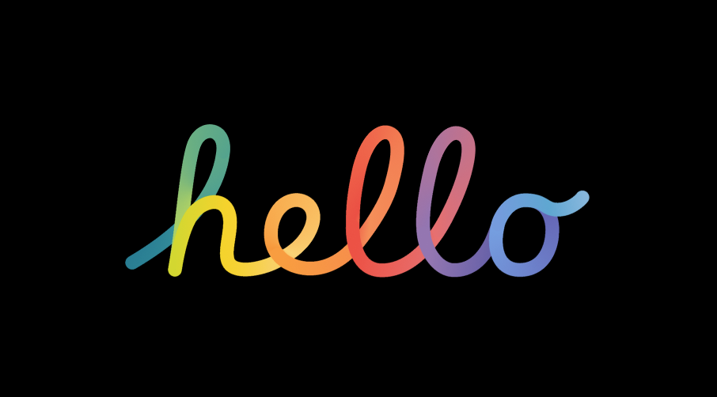

# Day 01 – Hello Animation (iOS Style)

📱 Recreated the nostalgic **iOS "Hello" screen animation** using **Figma**.  
This is part of a 25-day challenge where I post one unique UI animation every day!

---

## 🔍 Preview

---

## 📁 Files
- `hello-animation.fig` → Figma file
- `preview.png` → Preview image
- `README.md` → This file

---

## 🛠️ Tools Used
- Figma
- Smart Animate
- Custom Easing & Delays

---

## 🚀 How to Use
1. Download the `.fig` file.
2. Open in [Figma](https://www.figma.com/design/pProcb7DCOUBz0C9UWAmQg/Top-25-Bes-FIGMA-Projects?node-id=3-9&t=nz06hx34ntzon6wy-1).
3. Switch to **Prototype** tab and click **Present**.

---

## 🔗 Follow the Challenge
**Instagram:** [@daily_dose_of_development](https://instagram.com/daily_dose_of_development)

> 💡 24 more Figma animations coming! Save the repo and follow on IG to stay updated.

---

## ⭐ Star this repo if you find it useful!
