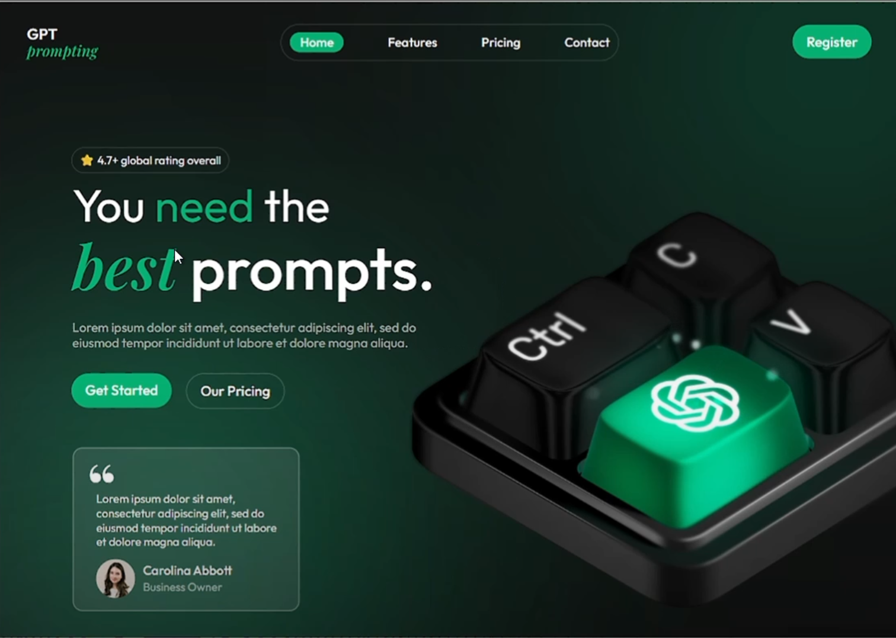

# Day 02 – GPT Prompting Hero Section

Created a dark-themed hero section inspired by GPT & AI tools.  
Ideal for prompt engineers, SaaS apps, or tech portfolios!

---

### 🔍 Preview

---

### 📁 Files
- `gpt-hero-section.fig`
- `preview.png`
- `README.md`

---

### ✨ Features
- 3D style keyboard with glowing GPT key
- Rounded Nav + Modern CTA
- 4.7⭐ Rating Tag
- Clean typography + contrast

---

### 🚀 How to Use
1. Open `.fig` file in [Figma](https://figma.com)
2. Switch to Prototype > Present
3. You can export it as image/HTML via plugins

---

### 🧠 Created for [@daily_dose_of_development](https://instagram.com/daily_dose_of_development)
