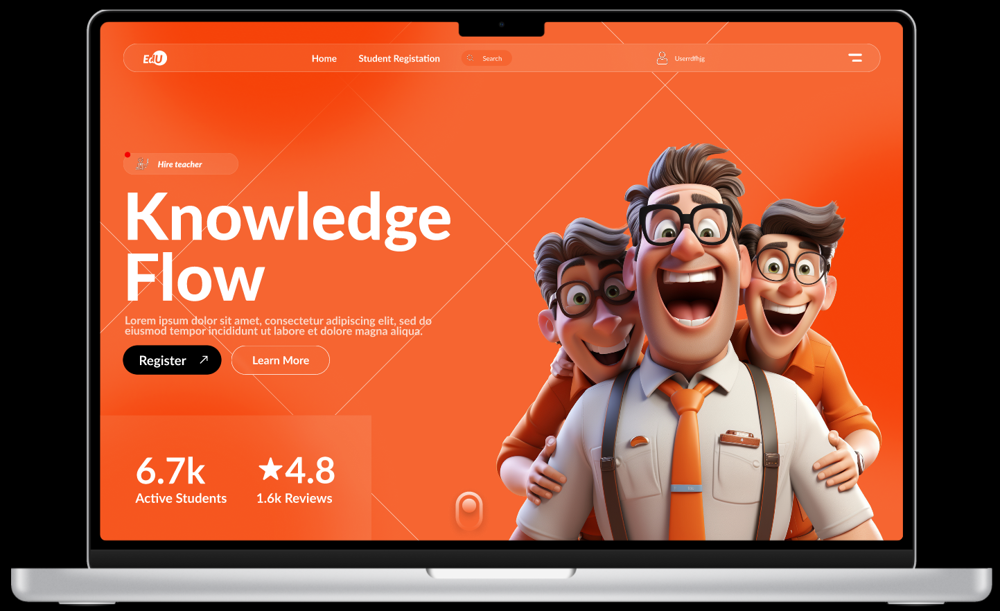

# Day 03 – EdTech Hero Section: "Knowledge Flow"

A bright, energetic hero section perfect for educational platforms, coaching apps, and LMS portals.

---

## 🔍 Preview

---

### 🧠 Highlights

- 3D teacher mascots for a fun brand appeal
- Bold orange palette with contrast buttons
- Custom navigation, hoverable CTAs
- Stats + rating system at bottom

---

### 📁 Files Included

- `day-03.fig`
- `preview.png`
- `README.md`

---

### 🔗 Live Preview

[View Design in Figma](https://www.figma.com/design/pProcb7DCOUBz0C9UWAmQg/Top-25-Bes-FIGMA-Projects?node-id=21-2&t=nBmIUKdWwTjYgw39-1)

---

### 💡 How to Use

1. Download the `.fig` file
2. Open in [Figma](https://figma.com)
3. Customize colors, mascot, or CTA as needed

---

### 🤝 Stay Connected

- 📸 Instagram: [@daily_dose_of_development](https://instagram.com/daily_dose_of_development)
- 🧠 25 Days, 25 Animations Challenge

---

> Made with 🎨 & ☕ by Meharsh aka Mahi
