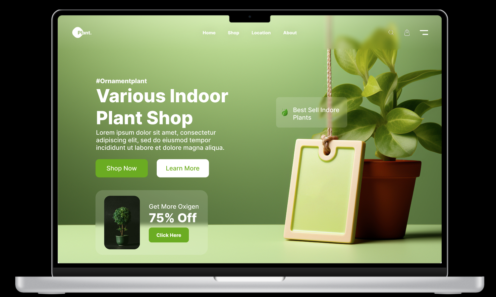

# Day 04 – Indoor Plant Shop Hero Section 🌿

A peaceful green-themed landing hero design for plant-based e-commerce or ornamental indoor plant brands.

---

## 🔍 Preview

---

### ✨ Features

- Calming green color palette
- Bold CTA buttons (Shop Now / Learn More)
- Tagline, Offer card, Product Image
- Simple navigation bar with cart/search icons

---

### 🧾 Use-Cases

- Indoor plant selling stores
- Subscription-based eco-product websites
- Gardening/landscaping agency sites

---

### 📁 Included Files

- `day-04.fig`
- `preview.png`
- `README.md`

---

### 🔗 Coming Soon

- Code (React + Tailwind)
- Mobile-responsive version

---

### 🔥 Join the Challenge

Follow [@daily_dose_of_development](https://instagram.com/daily_dose_of_development) for more 🔥 designs.

> 25 Days – 25 Figma UI Projects  
> Made with 🌿 and ☕ by Meharsh aka Mahi