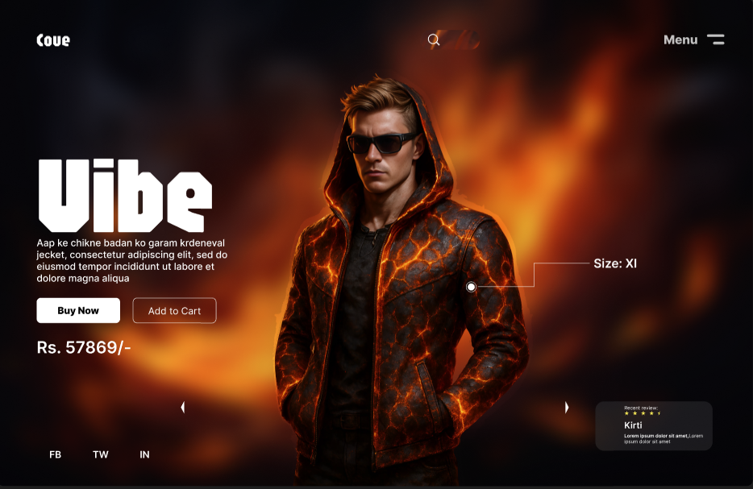

# Day 05 – 🔥 Lava Jacket Product Page UI

This UI represents a high-energy, luxury-streetwear landing page for a fictional lava-textured jacket brand called **Vibe**.

---

## 🔍 Preview

---

### ⚡ Key Features

- 🔥 High-impact product visual with glowing lava textures
- 🧑‍💼 Fashion model with dynamic lighting
- 🛒 'Buy Now' and 'Add to Cart' CTAs
- 🧵 Size highlight (XL)
- ⭐ Real-time review box
- 🌐 Social handles (FB, TW, IN)

---

### 💡 Inspiration

Aimed for a niche of gamers, fashion enthusiasts, and streetwear lovers who want **bold and animated** landing pages.

---

### 🛠️ Tech Plan (Coming Soon)

- React + Tailwind UI
- Responsive behavior for mobile screens
- Fire animation using `Framer Motion` or CSS 🔥

---

### 🔗 Social

Follow [@daily_dose_of_development](https://instagram.com/daily_dose_of_development) for daily UI 🔥 drops!

> 25 Days – 25 Figma UI Projects  
> ⚙️ Designed with flare by Mahi aka Meharsh
