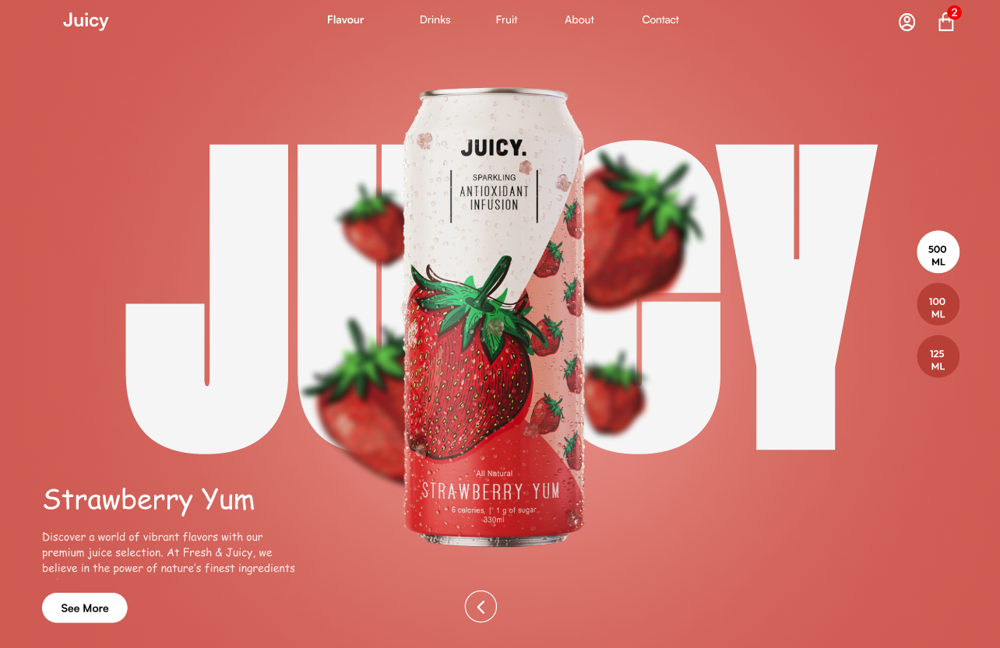

# Day 06 – 🍓 Juicy Strawberry Drink UI

This design is a landing page UI for a fruity drink brand called **Juicy.** The focus was to blend fresh product visuals with a modern and clean layout, mimicking real product sites.

---

## 🔍 Preview

---

### 🧃 UI Highlights

- 🍓 Centered 3D Product Can with soft drop shadow
- 🧭 Navigation bar with category links
- ⚪ Volume Selector (500ML, 100ML, 125ML)
- 📝 Product Description & CTA
- 🎯 Crisp white font on soft red background
- 🛍️ Cart Icon with Notification Badge

---

### ⚙️ Tools Used

- Figma (UI Design)
- [Planned]: React + GSAP/Framer Motion (for fluid animations)

---

### 💡 Design Intent

Inspired by premium beverage landing pages like Red Bull, Monster, or Gatorade — but with a **soft fruity twist.**  
The hero can is the _hero_, and every other UI element complements that center of attention.

---

### 🔗 Social

Follow [@daily_dose_of_development](https://instagram.com/daily_dose_of_development) for more daily UI projects 🍓

> DAY 06 out of 25 – Let’s keep the fizz going!
