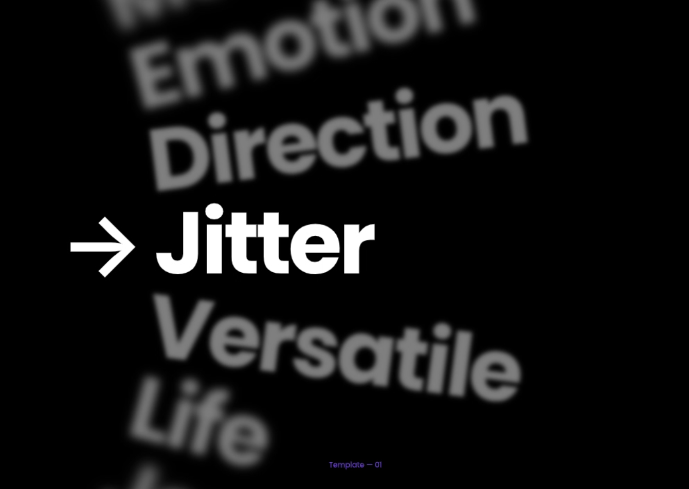

# 🎨 Day 07 - Motion Typography Scroll UI (Figma Project)

This is Day 07 of the **25 Days of Figma UI Challenge**.  
Today’s design focuses on **scroll-driven typography animation** — simulating motion, emotion, and focus using blur, scale, and direction shifts.

---

## 🔍 Preview

---

## 📌 Project Summary

> "What if typography could talk?"

Inspired by kinetic typography and motion UI trends, this Figma project creates the illusion of animated scrolling text using **Smart Animate**, **blur**, and **layering effects**.

---

## 🔧 Tools Used

- **Figma**
- Smart Animate
- Auto Layout
- Layer blur & text scaling
- Frame constraints & prototyping tools

---

## 🧠 Key Concepts Explored

- Motion design in static UI
- Scroll illusions via blur + z-index play
- Directional emphasis in text transitions
- Minimalist black/white layout

---

## 💡 Inspiration

This design was inspired by motion UI kits and websites like [Apple](https://apple.com) and [Readymag](https://readymag.com), where text tells a story not just by words — but by how it **moves**.

---