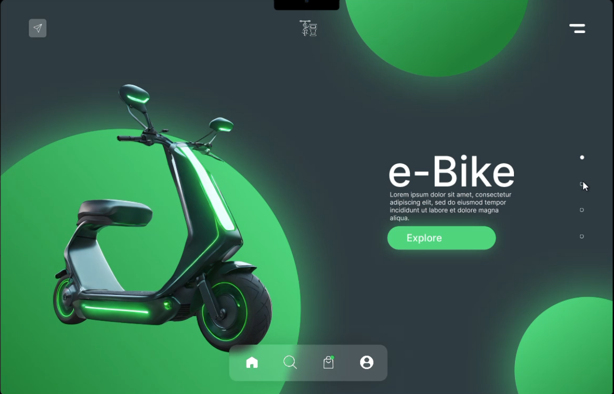

# ⚡ Day 08 - e-Bike Landing Page (Figma Project)

Welcome to **Day 08** of the **25 Days of Figma UI Challenge**!  
This project showcases a **modern, minimal, and futuristic Hero Section** for an electric scooter product.

---

## 🔍 Preview

---

## 🌐 Project Overview

> Designed for the new generation of EV startups 🚀

This landing page combines **3D visuals**, **neon green glow effects**, and clean typography to create a visually appealing product showcase for an **e-Bike** company.

---

## 🛠️ Tools Used

- **Figma** (for layout, auto-layout, and component structuring)
- 3D Rendered Image (used as mock asset)
- Gradients + Inner Shadows for depth

---

## 🎯 Key Features

- 🛵 3D e-Bike Image with Glow Accent
- 🌱 Green Energy Vibe (Neon Highlights)
- 🧭 Floating Navbar with icons (Home, Search, Cart, Profile)
- 📄 Right-side pagination for multiple product slides
- 🔘 Call-to-Action: “Explore” button with glowing hover style
- 🌓 Dark background for premium contrast

---

## 📁 Folder Structure
