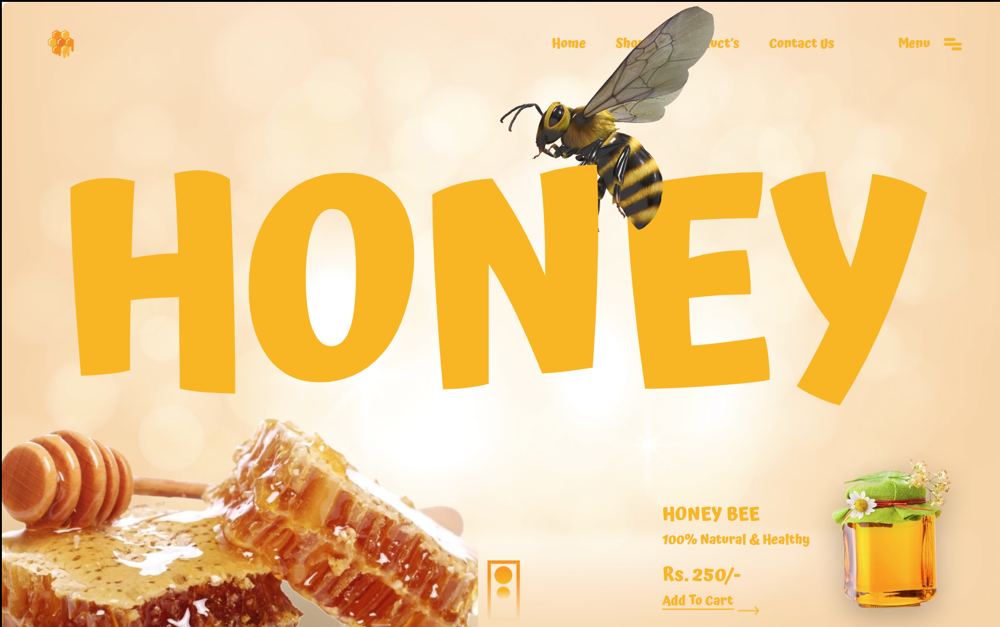

# 🍯 Day 09 - Honey Product Landing Page (Figma Project)

**Day 09** of the **25 Days of Figma UI Challenge** brings you a tasty and interactive landing page for a natural honey brand — featuring a **buzzing 3D bee animation** on the hero section 🐝

---

## 🔍 Preview

---

## 🌐 Project Overview

This landing page is crafted for **organic product companies** — especially honey sellers. The key highlight is a 3D animated bee that interacts with the viewer, making the site feel **alive and nature-inspired**.

---

## 🛠️ Tools Used

- **Dora** (Design, Layout, Component System)
- 3D Bee Image (.glb/.obj for actual web use)
- Gradient + Glow Styling

---

## 🎯 Key Features

- 🐝 Animated 3D bee hovering over "HONEY" text
- 🍯 Bright yellow-orange warm theme
- 📦 Call to Action with price + add to cart button
- 🍯 Realistic honeycomb image and jar
- 🧭 Sticky Navbar with menu + pages (Shop, Contact, etc.)

---

## 💡 Use Cases

Perfect for:
- 🐝 Organic Brands
- 🛍️ Product Landing Pages
- 🎯 Interactive UI Showcases
- 👨‍🍳 Honey or Gourmet Food Stores

---

## 🔗 Project Link

> [View on Dora](https://www.dora.run/e/2453522?copykey=b7816fff-8556-49cc-8d46-1c4f1b2aaf6e)

---

## 🍯 Fun Fact

> Honey never spoils. You can actually eat 3000-year-old honey found in Egyptian tombs!

---

📸 Instagram: [@daily_dose_of_development](https://instagram.com/daily_dose_of_development)  

---