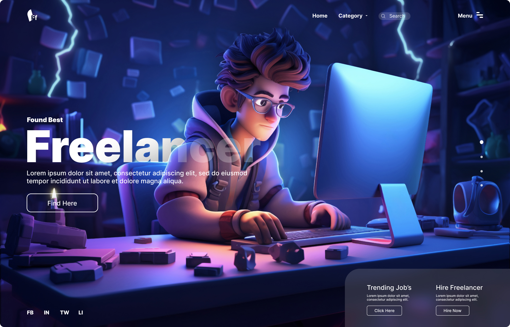

# 🧑‍💻 Day 10 - Freelancer Finder Landing Page (Figma Project)

Day 10 of the **25 Days of Figma UI Challenge** introduces a dynamic, character-driven **Freelancer Hiring UI**. Inspired by modern freelance culture, this layout combines **neon lighting**, **hero imagery**, and smart CTAs for a high-engagement landing page.

---

## 🔍 Preview

---

## 🌐 Overview

This design helps businesses or individuals connect with freelancers through a sleek, animated-themed interface. It feels energetic, modern, and very Gen-Z-friendly.

---

## 🔧 Tools & Stack

- **Figma** (Main UI/UX Tool)
- 3D Illustrations _(used from external source or plugins like Blush / Lottie preview)_
- Neon Color Palette: Blue-Purple-Violet

---

## 🎯 Key Features

- ⚡ Hero section with 3D cartoon freelancer character
- 📱 Responsive CTA: "Find Here", "Click Here", "Hire Now"
- 📊 Category Navigation dropdown
- 🔎 Search bar embedded in hero for quick access
- 🟢 Social footer icons for platform targeting: FB, IN, TW, LI

---

## 💼 Use Case

Perfect for:

- 🎯 Freelancer hiring platforms
- 🧑‍🎨 Portfolio / showcase landing pages
- 📢 Recruitment campaign pages
- 💡 Gen-Z targeted tech startups

---

📸 Instagram: [@daily_dose_of_development](https://instagram.com/daily_dose_of_development)  
🧠 Challenge: 25 Days of Figma UI

---

Next up: **Day 11 – Crypto Wallet Dashboard 🔐📈**
