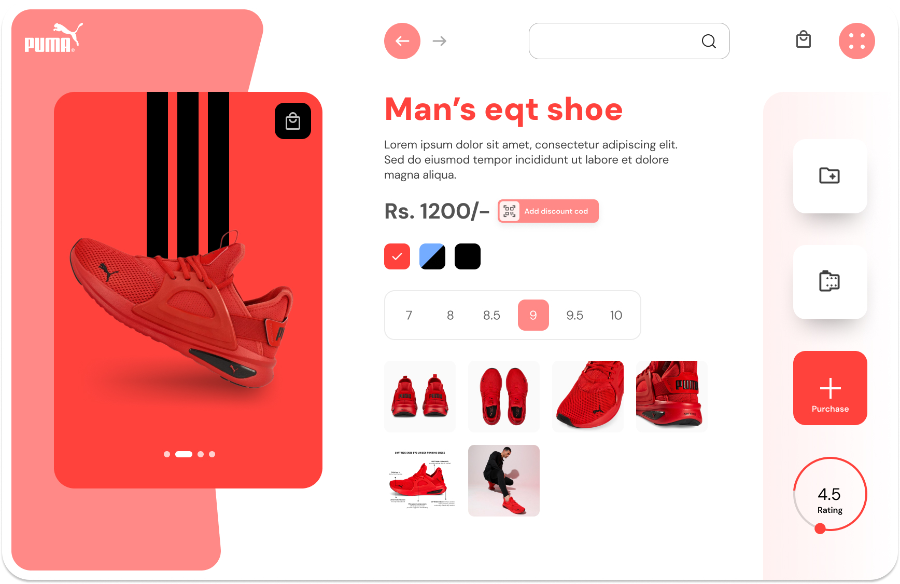

# 👟 Day 11 - Shoe Product Page UI (Figma Project)

Day 11 of the **25 Days of Figma Challenge** dives into the world of **e-commerce UI** with this elegant **Puma shoe product page**. Designed for modern retail platforms, this interface focuses on **user engagement**, **clear visuals**, and a **streamlined shopping experience**.

---

## 🔍 Preview

---

## 🛠️ Tech & Tools Used

- **Figma** (UI Design & Prototyping)
- Clean UI Grid
- Components: Cards, Buttons, Image Gallery, Color & Size Selector

---

## 🧩 Features

- 🖼️ Large product preview with swipe functionality  
- 🎨 Color switchers for different variants  
- 🔢 Shoe size selector (7 to 10)  
- 💰 Discount code CTA  
- ⭐ Rating bar (circular meter)  
- 🛒 Quick purchase button with minimalist design  
- 🔍 Secondary image thumbnails for detailed product view  
- 📦 Responsive layout structure (mobile-first adaptable)

---

## 💡 Ideal Use Case

- Ecommerce Product Pages  
- Brand-specific Shopping Sites (Puma, Adidas, etc.)  
- Fashion Tech Startups  
- UI Component Libraries (Product Card Designs)

---

## 🧠 Design Thought

> Keeping the shopping journey **minimal**, **user-focused**, and visually **satisfying**. Strong red accent color builds energy and urgency, ideal for sports/fashion products.

---

📸 Instagram: [@daily_dose_of_development](https://instagram.com/daily_dose_of_development)  
🔥 Series: *25 Days of Figma UI*  
🔖 Hashtags: #ecomUI #figmaDesign #sneakerheadUI  

---

Next Up: **Day 12 - Banking Dashboard / Wallet App UI 💳📊**