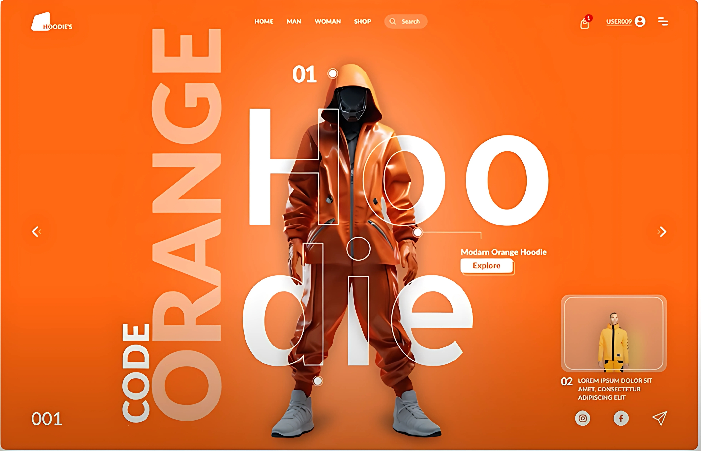

# 🧥 Day 12 - Fashion Hoodie Landing Page (Figma Project)

Day 12 of the **25 Days of Figma Challenge** is a creative spin on **fashion-forward product design**, centered around an **orange monochrome hoodie brand landing page**. This one combines **bold typography, 3D visuals**, and intuitive UX flow.

---

## 🔍 Preview

---

## 🛠️ Tools Used

- **Figma** (Design & Auto-layouts)
- Typography + Layered Effects
- Gradient overlays and blend-modes
- Image masks and mockups

---

## 🧩 Key Features

- 🧥 Hero Section with centered 3D hoodie model
- ✍️ Bold vertical + horizontal text alignment (`HOODIE`, `CODE ORANGE`)
- 🖱️ Clean CTAs: _Explore_, Next Product Preview
- 👤 Top-right user menu with notification indicator
- 🔄 Left/Right navigation for product carousel
- 🧭 Integrated search bar and category filter
- 🔗 Social handles below for brand connection

---

## 💡 Design Thought

> The goal was to create a visually **striking** fashion product landing page with a sense of **attitude**, **movement**, and **character identity**. The UI plays with **text layering** and **3D central focus** to grab attention fast.

---

📸 Instagram: [@daily_dose_of_development](https://instagram.com/daily_dose_of_development)  
🔥 Series: _25 Days of Figma UI_  
🔖 Tags: #uiux #fashionwebdesign #figma25 #orangevibes

---

Next Up: **Day 13 – Maybe a Portfolio Page? Or Fitness App UI? Let’s go wilder! 🧠🔥**
