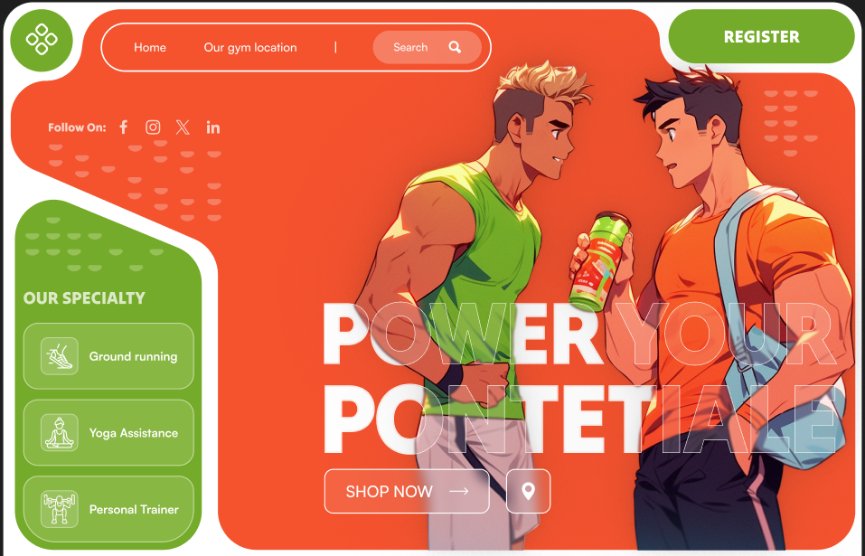

# 🏋️‍♂️ Day 13 - Gym Website Landing Page (Figma Project)

Day 13 in the **25 Days of Figma** brings you a fresh and pumped-up **Gym Landing Page UI**. With bold visuals, animated illustrations, and strong typography, this layout is perfect for a modern fitness brand.

---

## 🔍 Preview

---

## 🛠️ Tools Used

- **Figma**
- Auto Layout & Frame Components
- Vector Icons & Animated Characters
- Custom Typography with Gradient Overlays

---

## 🚀 Highlights

- 💪 Two animated characters representing fitness & energy
- 📍 Hero section with CTA: _Shop Now_ and _Gym Location_
- 🧘 Sidebar specialty blocks: Yoga, Running, Personal Trainer
- 📲 Clean top navbar with Register button
- 🔗 Social Media Links (FB, IG, X, LinkedIn)
- 🟢 Green-Orange color theme = energy + freshness

---

## 💭 Design Philosophy

> The idea was to **energize** users the moment they land on the page.  
> With animated, strong male characters, powerful colors, and straightforward CTAs, this UI is meant to feel both welcoming and dynamic.

---

🌐 Instagram: [@daily_dose_of_development](https://instagram.com/daily_dose_of_development)  
🧪 Series: _25 Days of Figma Projects_  
🟢 Tags: #figmafitness #uidesignchallenge #gymui #workoutweb

---

**Coming Up Next: Day 14 – Maybe a Music App UI or Travel Dashboard? 🎧🧳**
