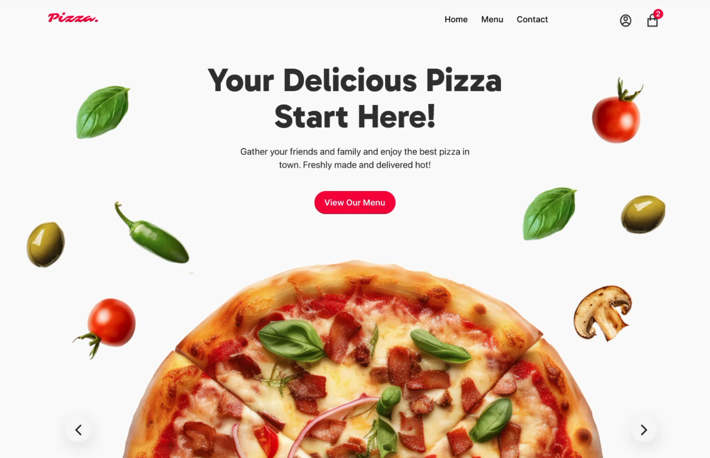

# 🍕 Day 14 - Pizza Ordering Website UI (Figma Project)

Welcome to Day 14 of the **25 Days of Figma Challenge**!  
Today’s UI is a mouth-watering landing page for a Pizza Delivery Brand.

---

## 🔍 Preview

---

## 🧰 Tools Used

- **Figma**
- Vector illustrations (toppings, ingredients)
- Custom font for food branding
- CTA styling with red highlight

---

## 🍽️ Features

- **Hero Section** with a floating pizza and ingredients
- Catchy title: _"Your Delicious Pizza Start Here!"_
- Centered CTA: **View Our Menu**
- Top navbar with cart icon (notification badge)
- Ingredients used as design elements for depth and freshness
- Fully responsive layout for web display

---

## ✨ Design Inspiration

> Simplicity meets appetite.  
> Designed to catch the viewer’s attention in 3 seconds and make them click _Order Now_ even if they’re on diet!

---

📷 Follow the journey on Instagram: [@daily_dose_of_development](https://instagram.com/daily_dose_of_development)  
📆 Project: _25 Days of Figma_  
📌 Day 14 – Pizza UI Website  
🍕 Tags: `#figmafood`, `#pizzaui`, `#uiuxdesign`, `#foodwebsite`

---

Stay tuned for **Day 15** – maybe a weather dashboard, music player, or something spicy again? 🌶️😎
