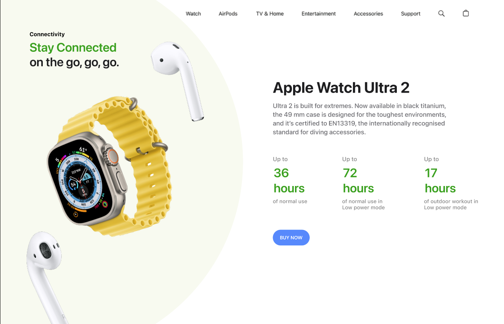

# ⌚ Day 15 – Apple Watch Ultra 2 UI Clone

As part of the **25 Days of Figma Challenge**,  
Day 15 is a **landing page clone** inspired by the official Apple website layout.

---

## 🔍 Preview

---

## 🎯 Objective

To replicate a real-world industry-standard UI focusing on:
- **Typography hierarchy**
- **White space balance**
- **Product focus design**

---

## 🧰 Tools Used

- **Figma**
- SF Pro Text Font (Apple Style)
- PNG renders of Apple Watch & AirPods

---

## 🔍 Features

- Floating watch model with shadow
- Battery life metrics in bold green
- One-click CTA (BUY NOW)
- Product description with certified standard info
- Top navbar (Watch, AirPods, Accessories, etc.)

---

## 🌟 Learning Outcome

> Simplicity is powerful.  
> I explored **font weight strategy**, **white-space optimization**, and **Apple’s information clarity approach** in UI.

---

🎨 Designed by Meharsh aka Mahi  
🔗 Insta: [@daily_dose_of_development](https://instagram.com/daily_dose_of_development)  
💡 25 Days of Figma Challenge | Day 15

---

**Stay tuned for Day 16** — Shall we go Dark Mode Music App or Crypto Dashboard next? 🌓💸