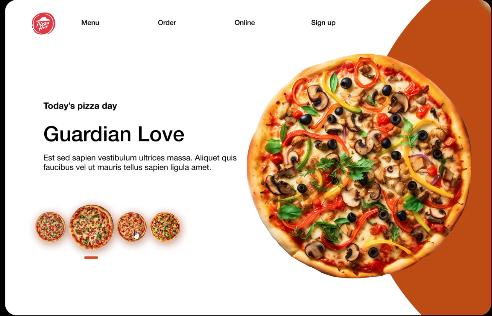

# 🍕 Day 16 – Pizza Hut UI Clone

As part of the **25 Days of Figma Challenge**,  
Day 16 features a **Pizza Hut inspired landing page** UI.

---

## 🔍 Preview

---

## 🎯 Objective

To capture the minimal and high-conversion design elements of a food delivery site:

- Bold headlines
- Centered content with eye-catching imagery
- Product carousel interaction

---

## 🧰 Tools Used

- **Figma**
- Custom pizza PNGs
- Color palette: Red, White, Black, Orange

---

## 🍕 Features

- Horizontal pizza selector (carousel-style)
- Focused product view ("Guardian Love")
- Typography emphasis on product names
- Simple nav: Menu | Order | Online | Sign Up

---

## 💡 Design Insight

> "Less clutter, more cravings."  
> Learned how **image scale** + **clear copy** directly affect user hunger triggers 😋

---

🧑‍🍳 Designed by Mahi  
🎨 Insta: [@daily_dose_of_development](https://instagram.com/daily_dose_of_development)  
🔥 25 Days of Figma | Day 16

---

Next up... maybe **a movie streaming app landing page?** 🍿🎥  
Or let's go wild with **VR shopping experience UI?** 🥽🛍️
