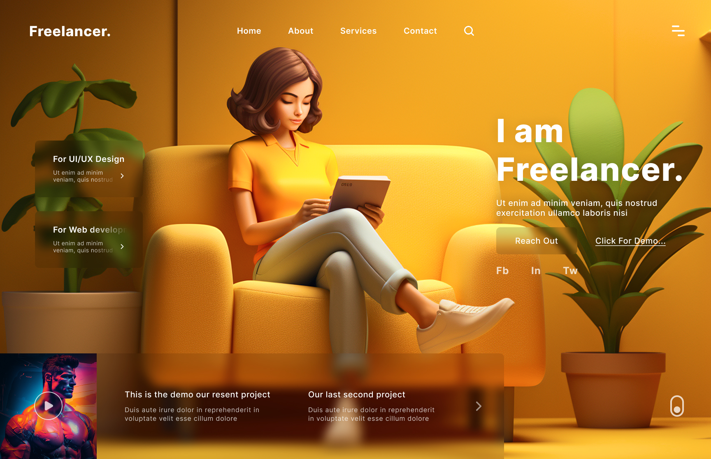

# 🎨 Day 17 – Freelancer Portfolio Website UI

This is the **Day 17** submission for my "25 Days of Figma" challenge.  
Today I created a minimal yet visually rich **Freelancer Landing Page**.

---

## 🔍 Preview

---

## 🌟 Highlights

- 3D-styled avatar for personality
- Primary call-to-action: “Reach Out”
- Secondary CTA: “Click for Demo” for project showcase
- Sections for UI/UX and Web Dev services
- Project thumbnails with hover animation
- Compact social links and navigation

---

## 🧰 Tools Used

- Figma
- Gradient overlays + glow effects
- Google Fonts: `Poppins` and `Inter`
- Inspiration: Dribbble + Awwwards

---

## 🧠 Learning Today

> “Freelancer websites don’t need to shout; they should **whisper confidence**.”

Learned how to organize **service-specific CTAs**, and play with **visual storytelling using cozy colors** 🎨

---

## ✍️ Designed by

Mahi (a.k.a. Meharsh)  
📸 [@daily_dose_of_development](https://instagram.com/daily_dose_of_development)  
💻 Portfolio: [Coming Soon]

---

Next Up?  
👉 **Day 18: E-learning Dashboard or a Fitness Tracker App** – stay tuned! 💡
