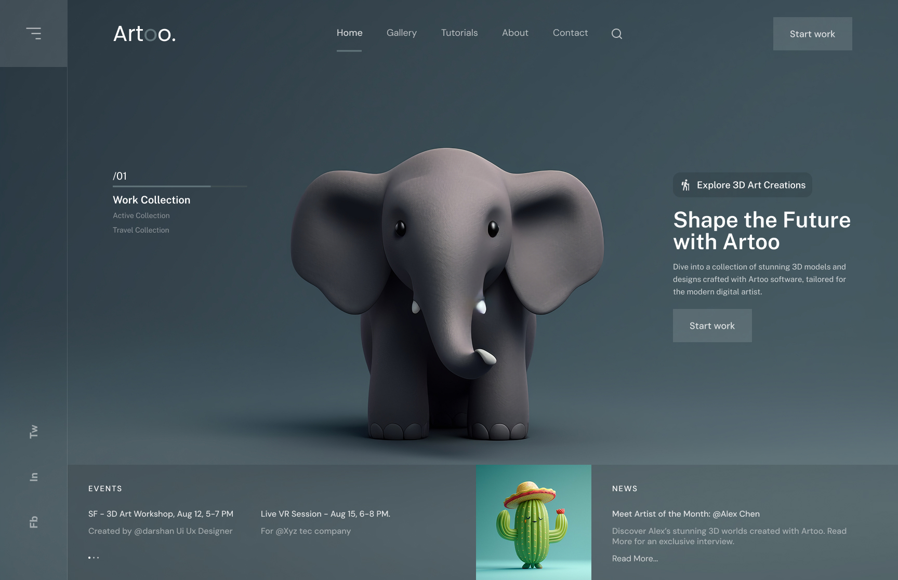

# 🐘 Day 18 – Artoo: 3D Art Gallery Website UI

For **Day 18** of the "25 Days of Figma" challenge, I created a minimal and artistic website concept for showcasing **3D digital art collections**.

---

## 🔍 Preview

---

## 🌟 Project Overview

This site focuses on presenting 3D artworks in a peaceful, distraction-free layout.

**Key Highlights**:

- 3D elephant model as hero visual
- Sections for:
  - Art collections
  - Upcoming events (e.g., VR sessions)
  - Artist of the month
- Calm monochrome background with elegant typography
- Soft glowing buttons and active navigation indicators

---

## 🔧 Tools Used

- Figma (layout & prototyping)
- Unsplash (image placeholders)
- Custom 3D Illustrations

---

## ✍️ Learning Today

- Balanced **visual hierarchy** between bold 3D elements and text
- Use of **negative space** for minimal elegance
- Blending UX flow with visual art elements 🧠🎨

---

## 🧑‍🎨 Designed By

**Meharsh "Mahi" Chandure**  
📸 Instagram: [@daily_dose_of_development](https://instagram.com/daily_dose_of_development)

---

🔜 **Day 19: A Music App or AR Pet Companion App UI** – what do you want to see next?
