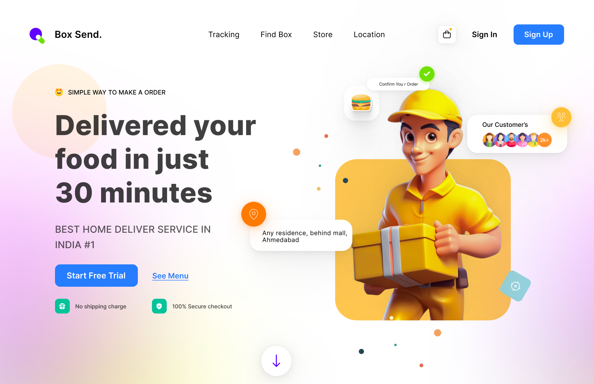

# 📦 Day 20 – Box Send: Food Delivery Website UI

Welcome to **Day 20 of 25 Days of Figma**!  
Today I designed a home page UI for a fictional food delivery service called **Box Send** – which focuses on **ultra-fast delivery, customer trust, and strong CTA design.**

---

## 🔍 Preview

---

## 🛵 Project Highlights

- ✅ Order Confirmation UI
- 👨‍💼 Delivery boy 3D illustration (custom color palette)
- 📍 Geo-location tag with live city name
- 👨‍👩‍👧‍👦 "2000+ Happy Customers" badge
- 🔐 Trust indicators: “No shipping charge” and “Secure checkout”
- 🔵 Bold CTAs like “Start Free Trial” & “See Menu”
- 🪄 Gradient background with soft confetti for lively vibes

---

## 🧠 Design Thinking

I followed the **Z-pattern layout** for better visual flow:

1. Headline & emoji ➝ user lands attention there.
2. Left-side CTA buttons ➝ key action points.
3. Right-side hero illustration ➝ visual hook.
4. Footer trust icons ➝ last persuasive points.

---

## 🎨 Tech Stack (For Dev)

- [ ] Figma (UI Design)
- [ ] Can be easily built using **React + Tailwind**
- [ ] Animated elements with Framer Motion
- [ ] Possible Firebase integration for order confirmation

---

## 💡 Ideal For:

- Food delivery startups
- 10-minute grocery startups
- Courier & logistics tracking platforms
- Landing pages for app promotions

---

### 🔧 Designed by: Meharsh “Mahi” Chandure

📸 Instagram: [@daily_dose_of_development](https://instagram.com/daily_dose_of_development)  
💬 Let’s collaborate on React + UI Dev!

---

⏭️ Up Next:  
Should we do a **music streaming app**, **freelancer dashboard**, or **resume builder**?  
Vote in my stories 🔥
