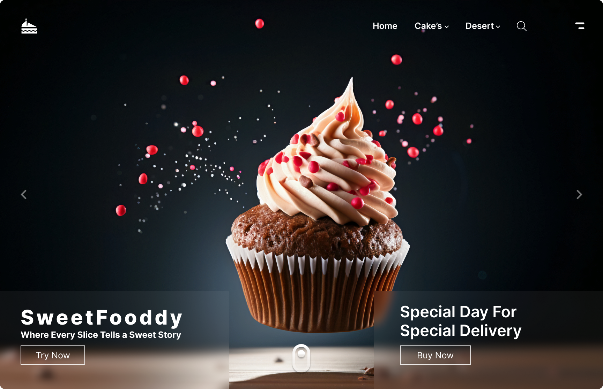

# 🍰 Day 23 – SweetFooddy: Bakery/Dessert Landing Page UI

**Welcome to Day 23** of my “25 Days of Figma” UI challenge!  
Today’s design is all about **sweet cravings and scrumptious presentation** — meet **SweetFooddy** 🎂

---

## 🔍 Preview

---

## 🎯 Purpose

A premium landing page design for:

- Bakeries 🧁
- Cake & dessert shops 🍰
- Online food gifting platforms 🎁

---

## ✨ Features

- 🍫 **Floating Cupcake Hero Image** with dynamic sprinkles
- 🍒 Two primary CTAs: _Try Now_ & _Buy Now_
- 🧭 Navigation with dropdowns:
  - Cake’s (Red Velvet, Chocolate, Fruit)
  - Dessert (Ice Creams, Pastries, Puddings)
- 🌚 Dark mode background with spot lighting effect
- 🎯 Scroll cue at center for extended menu

---

## 🧩 UI Components

| Element       | Description                            |
| ------------- | -------------------------------------- |
| Hero Image    | 3D rendered cupcake with layered cream |
| Nav Bar       | Transparent top bar + dropdowns        |
| CTA Buttons   | Border-only hover interactive buttons  |
| Background FX | Particle-like sprinkle drops floating  |

---

## 💡 Design Highlights

- Typography: `Poppins Bold` + `Inter`
- Colors: Chocolate brown + cream + candy red 🍫
- Layout: Center-focused, minimalist with visual punch
- Animation-friendly: Scroll-based cupcake float-in

---

## 🧠 Future Suggestions

- Add flavor selector modal 🍓🍫  
- Include recipe blog section 📝  
- Cart animation with "Add to Box" style 🧺  

---

🎨 Designed by Meharsh aka **Mahi**  
🎥 Follow the journey on Instagram: [@daily_dose_of_development](https://instagram.com/daily_dose_of_development)

Day 24 tomorrow — should we cook up a **movie streaming app** or a **travel planner UI**? Comment your vote! 🗳️

---
